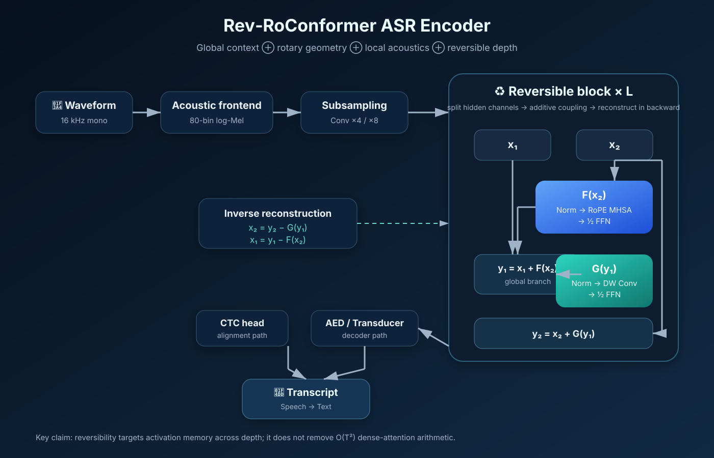

# 🎙️ Rev‑RoConformer

### *Reversible Depth × Rotary Geometry × Conformer Acoustics for Speech Recognition*

**Research preprint + open-source architecture proposal for memory-efficient deep Automatic Speech Recognition (ASR).**

**English · Tiếng Việt · 简体中文 · Русский · Español · Français**

[📄 Multilingual Preprint](paper/index.html) · [🔎 Research Gap](RESEARCH_GAP.md) · [🧪 Benchmark Protocol](EXPERIMENTS.md) · [📚 BibTeX](paper/references.bib)

---

## 💎 Discovery in one equation

\[
\boxed{T^2\;\oplus\;e^{it\Theta}\;\oplus\;\mathcal C_{local}\;\oplus\;R^{-1}R=I}
\]

Rev‑RoConformer asks one focused question:

> **Can an ASR Conformer keep RoPE global attention and local acoustic convolution while making training activation memory substantially less dependent on encoder depth through reversible additive coupling?**

The symbols are architectural shorthand, not one algebraic identity:

| Symbol | Represents | Does **not** imply |
|---|---|---|
| \(T^2\) | dense/global self-attention | lossless information or linear-time attention |
| \(e^{it\Theta}\) | RoPE rotation of query/key subspaces | removal of quadratic sequence compute |
| \(\mathcal C_{local}\) | Conformer local acoustic convolution | replacement of global context |
| \(R^{-1}R=I\) | reversible additive coupling | \(R^2=I\) or involutory submodules |

> **Sequence scaling and depth scaling are different problems.** Global attention remains quadratic in sequence length; reversibility targets activation storage that otherwise grows with depth.

---

## 🧭 Research status

**Preprint v0.1 · literature cutoff 25 July 2026 · not peer reviewed.**

### What is already established

- Conformer combines global self-attention and local convolution effectively for ASR.
- RoPE has already been applied and benchmarked in Conformer-family ASR.
- RevNet/Reformer-style additive coupling can reconstruct intermediate activations during backward computation.
- Very deep Conformers, including hundred-level encoders, have already been studied.
- RoPE and reversible residual layers have already coexisted in **TTS** through LinearSpeech.
- A **reversible Conformer** already exists in speech research: *Duplex Diffusion Models Improve Speech-to-Speech Translation* (ACL Findings 2023), using relative positional embedding for S2ST.

### What this project actually investigates

Our public-source audit did **not identify**, up to the cutoff date, a published ASR study matching the full intersection:

> **ASR + Conformer local convolution + RoPE attention + RevNet/Reformer-style additive-coupling activation reconstruction + controlled depth–memory–compute–WER evaluation against ordinary and gradient-checkpointed baselines.**

This is a **search result, not proof of non-existence**. The project never claims that nobody has ever built a reversible Conformer. See [RESEARCH_GAP.md](RESEARCH_GAP.md) for the reproducible audit and closest prior art.

---

## 🧩 Architecture

The hidden state is split along channels:

\[
X=[x_1;x_2].
\]

Forward coupling:

\[
y_1=x_1+F(x_2),\qquad y_2=x_2+G(y_1),
\]

where a candidate decomposition is

\[
F(z)=\mathrm{FFN}_{1/2}(z)+\mathrm{RoPEMHSA}(z),
\]

\[
G(z)=\mathrm{ConvModule}(z)+\mathrm{FFN}_{1/2}(z).
\]

Backward reconstruction:

\[
x_2=y_2-G(y_1),\qquad x_1=y_1-F(x_2).
\]

Therefore

\[
R^{-1}(R(X))=X.
\]

No individual attention, FFN or convolution module needs to be invertible.

---

## 📐 What can be proved before training

### 1. Depth-dependent activation storage

Under ordinary activation retention, a depth-\(L\) encoder contributes roughly

\[
M_{act,std}=\mathcal O(LBTd).
\]

Under ideal reversible execution, the retained **depth-dependent** state can approach

\[
M_{act,rev}=\mathcal O(BTd),
\]

plus transient recomputation buffers, attention workspaces, non-reversible boundaries, gradients, optimizer states and framework overhead.

This is the main theoretical efficiency claim.

### 2. RoPE preserves norm

For each 2-D rotary pair,

\[
R(\phi)^TR(\phi)=I
\]

and therefore

\[
\|R(\phi)z\|_2=\|z\|_2.
\]

### 3. Reversibility does not remove quadratic attention arithmetic

Dense global self-attention still requires approximately

\[
\mathcal O(T^2d)
\]

arithmetic. FlashAttention can improve exact-attention IO/memory behavior, but it solves a different bottleneck.

---

## ⚡ Evidence map

| Statement | Status |
|---|---|
| Conformer local + global modeling is effective for ASR | ✅ Established literature |
| RoPE works in ASR | ✅ Established literature |
| Reversible coupling can reconstruct activations | ✅ Established literature |
| Reversible Conformer exists in speech research | ✅ Established: S2ST prior art |
| Exact ASR + RoPE + reversible-depth scaling study found before cutoff | 🔎 **Not found in our public search** |
| Depth-dependent retained activation can lose its linear \(L\) term | 📐 Structural derivation |
| Rev‑RoConformer improves WER | 🧪 Unproven |
| Rev‑RoConformer is faster wall-clock | 🧪 Unproven; recomputation may be slower |
| Reversibility materially improves inference memory | ❌ Not a core claim |

**No fabricated benchmark numbers are published.**

---

## 🧪 Mandatory experiment matrix

| ID | Encoder | Position | Memory strategy |
|---|---|---|---|
| B0 | Conformer | Relative position | Standard |
| B1 | Conformer | RoPE | Standard |
| B2 | Rev-Conformer | Relative position | Reversible |
| **P** | **Rev‑RoConformer** | **RoPE** | **Reversible** |
| C1 | RoPE-Conformer | RoPE | Gradient checkpointing |

Three fairness regimes are required:

- **Iso-model:** same architecture, batch and sequence distribution.
- **Iso-memory:** same VRAM budget; measure useful depth/batch that actually fits.
- **Iso-compute:** comparable FLOPs/GPU-hours; charge reversible models for recomputation.

Primary metrics:

`WER · CER · peak VRAM · samples/s · audio-sec/s · GPU-hours · reconstruction error · max stable depth`

Full protocol: [EXPERIMENTS.md](EXPERIMENTS.md).

---

## 🔬 Falsifiable research questions

1. How much peak training memory is saved at matched model size?
2. Does reversible restructuring preserve ASR quality?
3. Does saved VRAM translate into a larger **useful** depth or batch?
4. How does reconstruction error accumulate in FP32/BF16/FP16?
5. How much throughput is lost to backward recomputation?
6. At what sequence length does attention become dominant over depth memory?
7. Does gradient checkpointing dominate the reversible Pareto frontier?

Negative results are scientifically valid.

---

## 🌐 Six-language HTML preprint

| Edition | Preprint |
|---|---|
| 🇬🇧 English | [paper/en.html](paper/en.html) |
| 🇻🇳 Tiếng Việt | [paper/vi.html](paper/vi.html) |
| 🇨🇳 简体中文 | [paper/zh-CN.html](paper/zh-CN.html) |
| 🇷🇺 Русский | [paper/ru.html](paper/ru.html) |
| 🇪🇸 Español | [paper/es.html](paper/es.html) |
| 🇫🇷 Français | [paper/fr.html](paper/fr.html) |

The original request named five languages while requesting six; French is included as the sixth edition.

---

## 🗺️ Open-source roadmap

**Phase 0 — Preprint & gap audit**  
Architecture, equations, falsifiable novelty statement, multilingual paper.

**Phase 1 — Reversible core**  
Inverse tests, custom autograd, RNG/dropout replay, gradient equivalence.

**Phase 2 — Numerical depth study**  
12 / 24 / 48 / 72 / 96 blocks in FP32 and BF16.

**Phase 3 — LibriSpeech 100 h**  
Fast ablations and memory profiling.

**Phase 4 — LibriSpeech 960 h**  
Main WER–memory–compute evaluation.

**Phase 5 — Cross-language**  
AISHELL-1, Common Voice and/or VoxPopuli.

**Phase 6 — Long-sequence extensions**  
FlashAttention, ×8 subsampling and optional local/sparse attention evaluated as separate variables.

---

## 📚 Closest literature

- Gulati et al. — **Conformer: Convolution-augmented Transformer for Speech Recognition** (2020)
- Gomez et al. — **The Reversible Residual Network** (2017)
- Kitaev et al. — **Reformer: The Efficient Transformer** (2020)
- Su et al. — **RoFormer** (2021)
- Li, Xu & Zhang — **Conformer-based End-to-end Speech Recognition With Rotary Position Embedding** (2021)
- Zhang et al. — **LinearSpeech** (Interspeech 2021): RoPE + reversible residuals in TTS
- Wu — **Deep Sparse Conformer for Speech Recognition** (Interspeech 2022)
- Dao et al. — **FlashAttention** (NeurIPS 2022)
- Wu — **Duplex Diffusion Models Improve Speech-to-Speech Translation** (ACL Findings 2023): reversible Conformer prior art
- Yao et al. — **Zipformer** (ICLR 2024)
- Zhang et al. — **Benchmarking Rotary Position Embeddings for Automatic Speech Recognition** (2025)

Machine-readable citations: [paper/references.bib](paper/references.bib).

---

## 🛡️ Scientific-integrity rules

1. **No invented benchmarks.** Results stay `TBD` until reproducible runs exist.
2. **No absolute novelty claim.** “Not found in our search” is not “proven never to exist.”
3. **No memory/compute conflation.** Reversible depth, checkpointing, FlashAttention and sparse attention attack different bottlenecks.
4. **Publish negative results.** If checkpointing wins, that boundary is a useful result.
5. **Every headline result must include** config, hardware/software versions, seed, decoding settings, memory methodology and raw logs.

---

## 📜 License & citation

Repository content is released under **Apache License 2.0**, unless a subdirectory states otherwise. Third-party datasets, models and publications retain their own licenses.

Citation metadata: [CITATION.cff](CITATION.cff).

---

### ✨ `Global context ⊕ Rotary geometry ⊕ Local acoustics ⊕ Reversible depth`

**Base27-CVNSS · Rev‑RoConformer Preprint Project · 2026**

